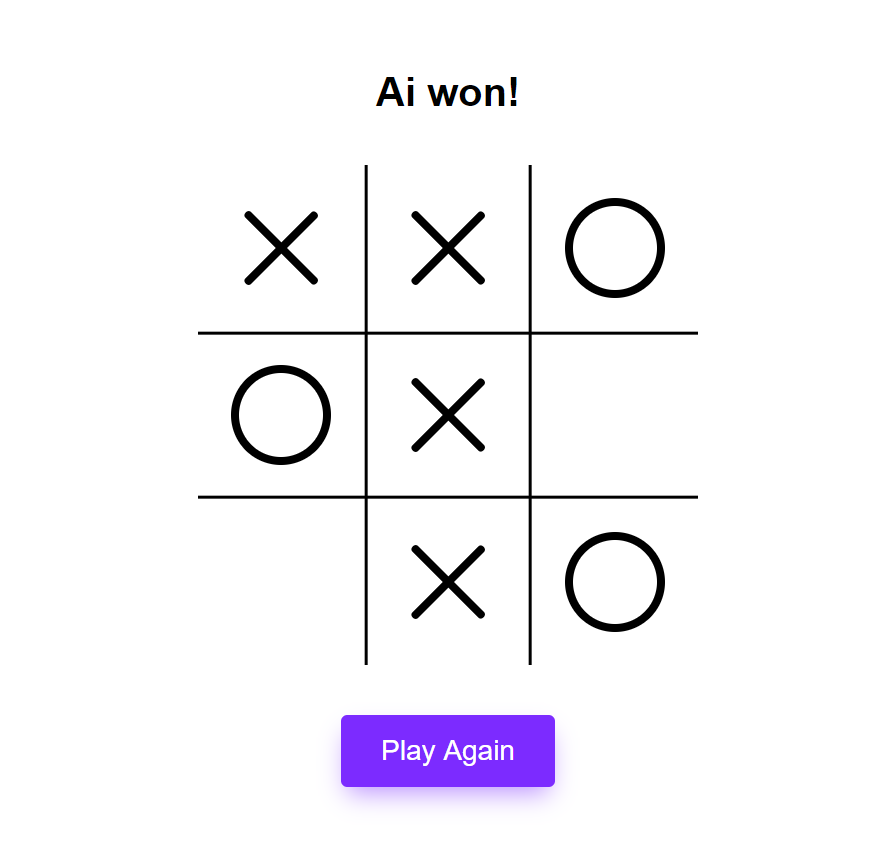

<p align="center">

  <h1 align="center">Tic Tac Toe AI</h1>

  <p align="center">
    An AI Tic Tac Toe Game where you can play with the AI
    <br />
    <br />
    <a href="https://tictactoebyrohid.netlify.com/">Play Now</a>
    ·
    <a href="https://github.com/rohid-hub/Ai_Tic_Tac_Toe/issues">Report Bug</a>
    ·
    <a href="https://github.com/rohid-hub/Ai_Tic_Tac_Toe/issues">Request Feature</a>
  </p>
</p>


<!-- TABLE OF CONTENTS -->
## Table of Contents

* [About the Project](#about-the-project)
  * [Built With](#built-with)
* [Getting Started](#getting-started)
  * [Pre Requirments](#pre-requirements)
  * [Installation](#installation)
* [Contact](#contact)


<!-- ABOUT THE PROJECT -->
## About The Project

<p align="center"><p>

It's a Tic Tac Toe Game but here you have to play with the AI instead of human ;-)
And for that there's only 5% of chances that you can win this game 🙂. If you think you are on of the 5% of people then give it a try 😜.

### Built With
Because this is a web based game that's why I choose react framework for the UI but you can make it with just simple HTML, CSS and JavaScript.
* React
* JavaScript
* HTML
* CSS/SCSS


<!-- GETTING STARTED -->
## Getting Started

Here's how you can use this project

### Pre Requirements

Pre requirements are
* git
* node.js
* react

### Installation

1. First clone the repo
```sh
git clone git@github.com:rohid-hub/Ai_Tic_Tac_Toe.git
```
3. Install NPM packages
```sh
npm install
```
4. Now start the server
```sh
npm start
```


<!-- CONTACT -->
## Contact

Rohidul Islam - [email](rohidul677@gmail.com)

Github Link: [rohid-hub](https://github.com/rohid-hub)